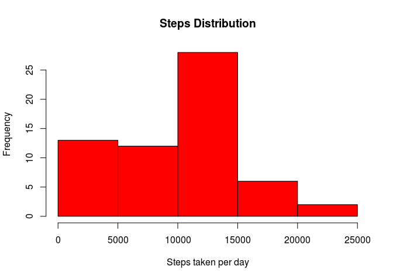
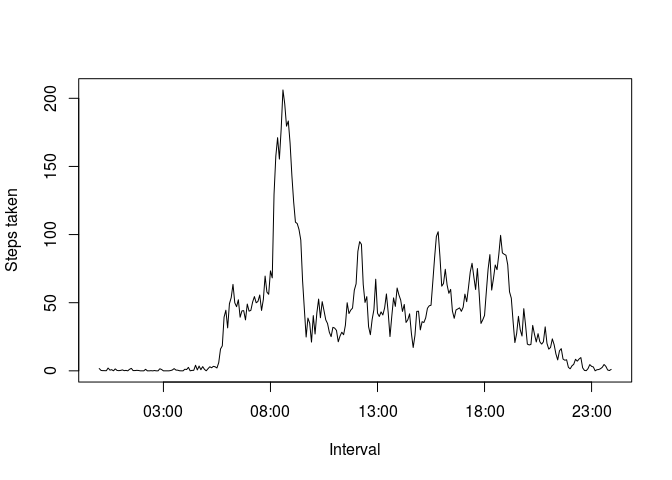
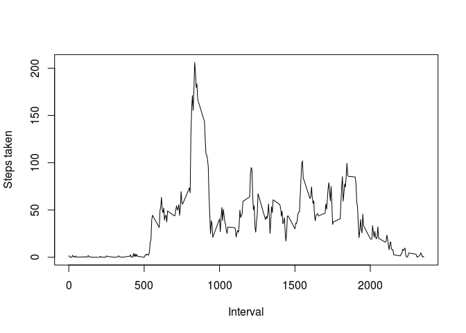
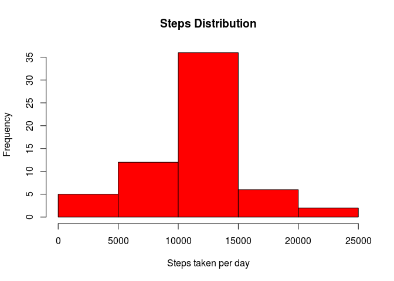
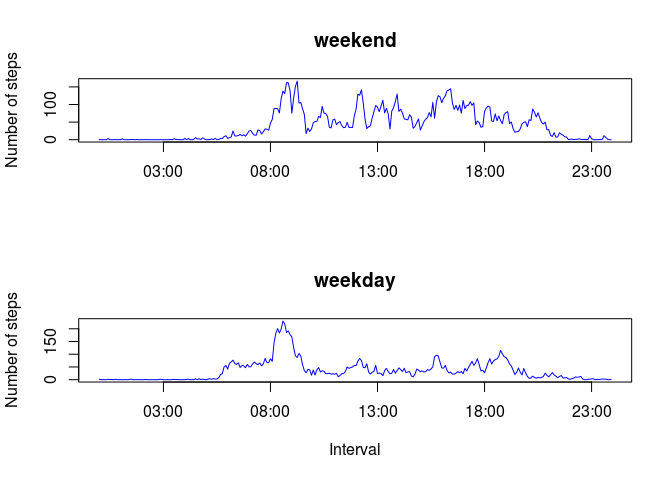

# Reproducible Research: Peer Assessment 1

## Introduction
In this document, we are going to analyse the personal activity of an anonymous individual. The data is collected at 5-minute intervals through out the day by a personal activity monitoring device. It consists of two months of data during the months of October and November, 2012 and includes the number of steps taken in 5-minute intervals each day.

R programming language and relevant facilities will be used to perform the analysis procedure.

## Data
One can download the dataset from [Activity monitoring data](https://d396qusza40orc.cloudfront.net/repdata%2Fdata%2Factivity.zip).

The variables included in this dataset are:

- steps: Number of steps taken in a 5-minute interval (missing values are coded as NA)

- date: The date on which the measurement was taken in YYYY-MM-DD format

- interval: Identifier for the 5-minute interval in which measurement was taken

The dataset is stored in a comma-separated-value (CSV) file and there are a total of 17,568 observations in this dataset.

## Loading and preprocessing the data
The first thing we need to do is to load the raw data and do some preprocessing for later use.

```r
# the data file in the current working directory
acts <- read.csv("activity.csv")
```

The "interval" field in the raw data has the integer type. An auxiliary function "intToTime" is used to convert an integer to a time type. The reason why we need to convert the integral "interval" to a time type will be explained later when we are actually using this column.

```r
intToTime <- function(n) {
    h <- n %/% 100
    m <- n %% 100
    strptime(paste(h, m, sep=":"), format="%H:%M")
}
```

Then we convert the whole "interval" column to a new "time" column and add that column to the dataset.

```r
time <- do.call(c, lapply(acts$interval, intToTime))
acts <- cbind(acts, time)
```

Another thing is that some observations in the raw dataset contain missing values. But we are not preprocessing missing values here. We will figure out a good way to tackle the NA problem once we know better of the data as we step through the analysis procedure.

## What is mean total number of steps taken per day?
To find out the mean of the total number of steps taken per day, we need to firstly sum the steps on a daily basis, then take the average value of the summarized steps value. Here we just ignore the missing values. And a histogram will help observe the rough distribution of steps taken daily. Illustrated as follows:

```r
sumByDate <- aggregate(acts$steps, by=list(acts$date), sum, na.rm=T)
meanVal <- mean(sumByDate[, 2])
medianVal <- median(sumByDate[, 2])

with(sumByDate, hist(x,
        xlab="Steps taken per day",
        main="Steps Distribution",
        col="red")
)
```

 

As we can see, most of the days, the steps taken by the individual are around between 10000 and 15000. More and less steps are also taken in some other days but with less frequencies. From the histogram, the distribution of steps taken per day kind of follows a normal distribution, but with the exception that the number of days the individual takes less steps a little bit high. The reason is that some "steps" data is missing from some of the days and we are ignoring the missing values here, so the summation of "steps" for these days are just zero, hence the high frequency of small value of steps taken per day.

The mean and median of total number of steps taken per day are 9354 and 10395.

## What is the average daily activity pattern?
To find out the average daily activity pattern, we firstly aggregate the data on a 5-minute-interval basis. A time series plot will help observe how the steps taken during intervals vary across the day. Again here we ignore the missing values.

```r
meanByTime <- aggregate(acts$steps, by=list(acts$time), mean, na.rm=T)
names(meanByTime) <- c("time", "steps")
maxSteps <- max(meanByTime$steps)
ord <- order(-meanByTime$steps)
maxAt <- format(meanByTime[ord[[1]], 1], "%H:%M")

with(meanByTime, plot(steps ~ time, type="l",
                    xlab="Interval",
                    ylab="Steps taken")
)
```

 

For all of the 5-minute intervals across a day, the maximum number of steps, which is 206, occurs at 08:35. That is the usual time when people start a daily activity. From the time series plot, we can also see that in the intervals around the highest one, high value of steps are also taken by the individual. It's very possible that the individual is on his(her) way to work or study around that time. Therefore not only is he(she) taking more steps than other intervals, but also his(her) step frequency is higher than other times of the day, possibly because of in his(her) hurry. As we all know that the way to the office or school in the morning is kind of a rush. Just imagine the face of your boss or teacher if you couldn't manage to arrive on time.

Another thing worth mention is the reason why we need to convert the interval from an integer type to a time type. If we don't perform the conversion, we can still plot the time series plot by using the integral interval as x-axis value and get a similar plot. But that plot will be not the same as the one we get here because the integer type actually has more slots than time type so that the resulting plot kind of stretches out slightly differently in horizontal direction. Say here we use two digits to express the minute of the time point. As an integer type, two digits can represent 100 slots, but as a time type, it only represent 60 slots. Once the minute part gets to 60, it's cleared and the hour part is incremented. If treated as an integer type, the interval values are not evenly distributed because there is a 40-slot gap at the end of each hour. When plotted, these 40-slot gapes take their places on x-axis. Therefore these parts of the plot will be more stretching out horizontally. At the same time, because the integer interval has more slots than time interval on the same length of horizontal axis, as a whole, the plot will be tighter horizontally. Comparing with the time type, the integer interval is like putting more stuff in a pipe with the same length. Although these two plots are very similar, one can still tell these differences by naked eyes. The following plot is drawn by using the integer interval as x-axis.
 

## Imputing missing values
In the previous analysis, we just ignored the missing values and we saw how it biases the effectiveness of the whole dataset. So here we are gonna figure out a better way to impute the missing values. Let's first find out the number of records with missing values.

```r
cc <- complete.cases(acts)
naCnt <- length(cc) - sum(cc)
```

Well, there are 2304 rows with missing values for "steps" column. Not a small portion for a dataset with 17568 records. No wonder the histogram for steps distribution we draw before biased to the lower values.

But how are we gonna impute these missing values? A reasonable strategy is to fill in the missing values with the existing values from the same time of the a day. As we know, human activity is periodic, basically on a daily basis. We tends to do the same things around the same time of a day. We work or study at day and sleep at night. We eat breakfast, lunch and dinner day by day around the same time. And we watch TV or read before going to bed, etc. The point is that we act similarly at the same time of the most of the days. So here we will take the mean of steps of the same 5-minute interval to fill in the missing values. The median should be workable too. Just a matter of choice.

```r
# filter out the rows without NAs
actsNona <- acts[cc, ]
meanByTime <- aggregate(actsNona$steps, by=list(actsNona$time), mean)
names(meanByTime) <- c("time", "msteps")
acts <- cbind(acts, meanByTime$msteps)
# get the indexes of rows with NAs
ncc <- !cc
# assign the mean value of same intervals to NAs
acts[ncc, 1] <- acts[ncc, 5]
```

Now that we have filled in the missing values, let's draw the same histogram as before to see how step distribution changes.

```r
sumByDate <- aggregate(acts$steps, by=list(acts$date), sum)
meanVal <- mean(sumByDate[, 2])
medianVal <- median(sumByDate[, 2])
with(sumByDate, hist(x,
        xlab="Steps taken per day",
        main="Steps Distribution",
        col="red")
)
```

 

Now the steps distribution looks more normal than the previous one.

And also, the mean and median of total number of steps taken per day are 10766 and 10766. Surprisingly, the mean and median are the same now, which actually is not so surprising. Two reasons cause the sameness of the mean and median.

Firstly, when the "steps" values are missing, it happens to all the intervals for a whole day. Put it another way, for a specific day, either it has "steps" values for each interval or it has no "steps" value for all the intervals. When filled in, each missing value gets the mean value of corresponding interval calculated from the days with that value, which means that the sum of "steps" values for a filled day is the same as the mean value of the total number of "steps"" of the days without missing values in the first place. And this mean value is also the mean of the total number of "steps" for all the dataset with the missing values filled in.

Secondly, the steps distribution is kind of normal in the first place and the mean is close to the center. When filling in the missing values, we are kind of moving some extremely biased values to the center of the distribution, so there are a range of same mean values around the center of the distribution, and the median of all happens to be in that range.

Using a few lines of R code, one can easily find out how many of the days with total steps greater or less than the mean, also how many days with missing values which will be moved to the center after imputation.

## Are there differences in activity patterns between weekdays and weekends?
Lastly, let's explore the activity patterns by differentiating days as weekdays and weekends. We know that life in working days and weekend are different, but what kind of differences can we find from this fellow?

Let's first separate the data for weekdays and weekends.

```r
wd <- weekdays(as.Date(acts$date))
wd[wd == "Monday"] <- "weekday"
wd[wd == "Tuesday"] <- "weekday"
wd[wd == "Wednesday"] <- "weekday"
wd[wd == "Thursday"] <- "weekday"
wd[wd == "Friday"] <- "weekday"
wd[wd == "Saturday"] <- "weekend"
wd[wd == "Sunday"] <- "weekend"
wd <- as.factor(wd)
acts <- cbind(acts, wd)

acts_weekend <- acts[acts$wd == "weekend", ]
meanByWeekendTime <- aggregate(acts_weekend$steps, by=list(acts_weekend$time), mean)
names(meanByWeekendTime) <- c("time", "steps")
maxWe <- max(meanByWeekendTime$steps)

acts_weekday <- acts[acts$wd == "weekday", ]
meanByWeekdayTime <- aggregate(acts_weekday$steps, by=list(acts_weekday$time), mean)
names(meanByWeekdayTime) <- c("time", "steps")
maxWd <- max(meanByWeekdayTime$steps)
```

Then let's draw time series plots for the two datasets and put them together to see how they differ.

```r
par(mfrow=c(2, 1))
with(meanByWeekendTime, plot(steps ~ time, type="l",
                        xlab="",
                        ylab="Number of steps",
                        main="weekend",
                        col="blue")
)
with(meanByWeekdayTime, plot(steps ~ time, type="l",
                        xlab="Interval",
                        ylab="Number of steps",
                        main="weekday",
                        col="blue")
)
```

 

Several observations we can make from this plot.

Firstly, the fellow is more active in weekend than in a working day, which actually makes sense. During a working day, most of the time, we stay sitting or in a small area to do our work. But in weekend, we have more free time to do things like working out, travelling around and shopping, etc., the more active things we are unable to do in a working day. But the peak steps of weekend, say 166, is much less than the peak steps of a working day, say 230, just because of the morning rush hour for a working day.

Secondly, we usually get up later in weekend than in a working day because we don't have that pressure to get to the working place on time. From the plot, we can see that the individual starts to be active just a little bit later than in a working day. But in a working day, before he(she) gets to the active peak, the individual has been keeping active for a quite long period. Most likely, he(she) is doing some morning routines before going out for work. In the weekend, things are just getting more leisurely than usual.

Thirdly, the active period lasts longer in weekend than in a working day. In weekend, we usually hang out more late in the night than usual because we don't have the pressure to get up early next morning for our work.

(The plot here is not exactly as the one shown in the assignment instructions. I simply don't know how to draw a plot like that one now. I started learning R two weeks ago and haven't got the chance to learn lattice and ggplot2. So here I only use the base plotting system to draw the plot. But the point is that we put the plots together so that we can compare them to find the differences.)
